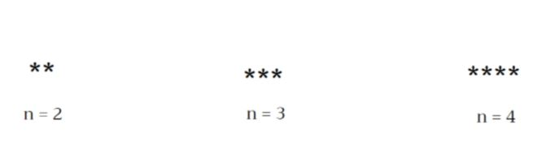
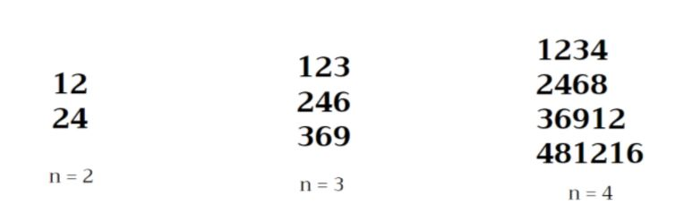
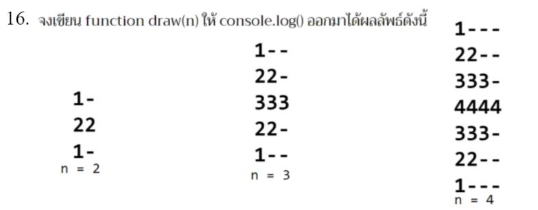

# Basic JS Part2 : Function&Loop_Exercise

## ข้อ1-4
[1.จงเขียนฟังก์ชัน ให้ console.log แสดงผลออกมาเมื่อรับค่า n เป็นพารามิเตอร์ดังนี้](https://docs.google.com/presentation/d/1c29n1gEZtH0YWYoxhFgKIi4D7bybkYH7e8sNNXwfseg/edit#slide=id.g7e55189d07_9_105
)



```js
// Finish and Paste your solution here


```

[2.จงเขียนฟังก์ชัน ให้ console.log แสดงผลออกมาเมื่อรับค่า n เป็นพารามิเตอร์ดังนี้](https://docs.google.com/presentation/d/1c29n1gEZtH0YWYoxhFgKIi4D7bybkYH7e8sNNXwfseg/edit#slide=id.g7e55189d07_9_114
)


```js
// Finish and Paste your solution here


```
[3.จงเขียนฟังก์ชัน ให้ console.log แสดงผลออกมาเมื่อรับค่า n เป็นพารามิเตอร์ดังนี้](https://docs.google.com/presentation/d/1c29n1gEZtH0YWYoxhFgKIi4D7bybkYH7e8sNNXwfseg/edit#slide=id.g7e55189d07_9_123
)


```js
// Finish and Paste your solution here


```

[4.จงเขียนฟังก์ชัน ให้ console.log แสดงผลออกมาเมื่อรับค่า n เป็นพารามิเตอร์ดังนี้](https://docs.google.com/presentation/d/1c29n1gEZtH0YWYoxhFgKIi4D7bybkYH7e8sNNXwfseg/edit#slide=id.g7e55189d07_9_132
)


```js
// Finish and Paste your solution here


```

## ข้อ5-8
[5.จงเขียนฟังก์ชัน ให้ console.log แสดงผลออกมาเมื่อรับค่า n เป็นพารามิเตอร์ดังนี้](https://docs.google.com/presentation/d/1c29n1gEZtH0YWYoxhFgKIi4D7bybkYH7e8sNNXwfseg/edit#slide=id.g7e55189d07_9_141
)


```js
// Finish and Paste your solution here


```

[6.จงเขียนฟังก์ชัน ให้ console.log แสดงผลออกมาเมื่อรับค่า n เป็นพารามิเตอร์ดังนี้](https://docs.google.com/presentation/d/1c29n1gEZtH0YWYoxhFgKIi4D7bybkYH7e8sNNXwfseg/edit#slide=id.g7e55189d07_9_150
)


```js
// Finish and Paste your solution here


```
[7.จงเขียนฟังก์ชัน ให้ console.log แสดงผลออกมาเมื่อรับค่า n เป็นพารามิเตอร์ดังนี้](https://docs.google.com/presentation/d/1c29n1gEZtH0YWYoxhFgKIi4D7bybkYH7e8sNNXwfseg/edit#slide=id.g7e55189d07_9_160
)


```js
// Finish and Paste your solution here


```

[8.จงเขียนฟังก์ชัน ให้ console.log แสดงผลออกมาเมื่อรับค่า n เป็นพารามิเตอร์ดังนี้](https://docs.google.com/presentation/d/1c29n1gEZtH0YWYoxhFgKIi4D7bybkYH7e8sNNXwfseg/edit#slide=id.g7e55189d07_9_170
)


```js
// Finish and Paste your solution here


```

## ข้อ9-12
[9.จงเขียนฟังก์ชัน ให้ console.log แสดงผลออกมาเมื่อรับค่า n เป็นพารามิเตอร์ดังนี้](https://docs.google.com/presentation/d/1c29n1gEZtH0YWYoxhFgKIi4D7bybkYH7e8sNNXwfseg/edit#slide=id.g7e55189d07_9_180
)


```js
// Finish and Paste your solution here


```

[10.จงเขียนฟังก์ชัน ให้ console.log แสดงผลออกมาเมื่อรับค่า n เป็นพารามิเตอร์ดังนี้](https://docs.google.com/presentation/d/1c29n1gEZtH0YWYoxhFgKIi4D7bybkYH7e8sNNXwfseg/edit#slide=id.g7e55189d07_9_190
)



```js
// Finish and Paste your solution here


```
[11.จงเขียนฟังก์ชัน ให้ console.log แสดงผลออกมาเมื่อรับค่า n เป็นพารามิเตอร์ดังนี้](https://docs.google.com/presentation/d/1c29n1gEZtH0YWYoxhFgKIi4D7bybkYH7e8sNNXwfseg/edit#slide=id.g7e55189d07_9_200
)


```js
// Finish and Paste your solution here


```

[12.จงเขียนฟังก์ชัน ให้ console.log แสดงผลออกมาเมื่อรับค่า n เป็นพารามิเตอร์ดังนี้](https://docs.google.com/presentation/d/1c29n1gEZtH0YWYoxhFgKIi4D7bybkYH7e8sNNXwfseg/edit#slide=id.g7e55189d07_9_210
)


```js
// Finish and Paste your solution here


```

## ข้อ13-16
[13.จงเขียนฟังก์ชัน ให้ console.log แสดงผลออกมาเมื่อรับค่า n เป็นพารามิเตอร์ดังนี้](https://docs.google.com/presentation/d/1c29n1gEZtH0YWYoxhFgKIi4D7bybkYH7e8sNNXwfseg/edit#slide=id.g7e55189d07_9_220
)


```js
// Finish and Paste your solution here


```

[14.จงเขียนฟังก์ชัน ให้ console.log แสดงผลออกมาเมื่อรับค่า n เป็นพารามิเตอร์ดังนี้](https://docs.google.com/presentation/d/1c29n1gEZtH0YWYoxhFgKIi4D7bybkYH7e8sNNXwfseg/edit#slide=id.g7e55189d07_9_230
)


```js
// Finish and Paste your solution here


```
[15.จงเขียนฟังก์ชัน ให้ console.log แสดงผลออกมาเมื่อรับค่า n เป็นพารามิเตอร์ดังนี้](https://docs.google.com/presentation/d/1c29n1gEZtH0YWYoxhFgKIi4D7bybkYH7e8sNNXwfseg/edit#slide=id.g7e55189d07_9_240
)


```js
// Finish and Paste your solution here


```

[16.จงเขียนฟังก์ชัน ให้ console.log แสดงผลออกมาเมื่อรับค่า n เป็นพารามิเตอร์ดังนี้](https://docs.google.com/presentation/d/1c29n1gEZtH0YWYoxhFgKIi4D7bybkYH7e8sNNXwfseg/edit#slide=id.g98cf33d123_6_0
)



```js
// Finish and Paste your solution here


```

## ข้อ17-20
[17.จงเขียนฟังก์ชัน ให้ console.log แสดงผลออกมาเมื่อรับค่า n เป็นพารามิเตอร์ดังนี้](https://docs.google.com/presentation/d/1c29n1gEZtH0YWYoxhFgKIi4D7bybkYH7e8sNNXwfseg/edit#slide=id.g7e55189d07_9_261
)


```js
// Finish and Paste your solution here


```

[18.จงเขียนฟังก์ชัน ให้ console.log แสดงผลออกมาเมื่อรับค่า n เป็นพารามิเตอร์ดังนี้](https://docs.google.com/presentation/d/1c29n1gEZtH0YWYoxhFgKIi4D7bybkYH7e8sNNXwfseg/edit#slide=id.g7e55189d07_9_279
)


```js
// Finish and Paste your solution here


```
[19.จงเขียนฟังก์ชัน ให้ console.log แสดงผลออกมาเมื่อรับค่า n เป็นพารามิเตอร์ดังนี้](https://docs.google.com/presentation/d/1c29n1gEZtH0YWYoxhFgKIi4D7bybkYH7e8sNNXwfseg/edit#slide=id.g7e55189d07_9_287
)


```js
// Finish and Paste your solution here


```

[20.จงเขียนฟังก์ชัน ให้ console.log แสดงผลออกมาเมื่อรับค่า n เป็นพารามิเตอร์ดังนี้](https://docs.google.com/presentation/d/1c29n1gEZtH0YWYoxhFgKIi4D7bybkYH7e8sNNXwfseg/edit#slide=id.g7e55189d07_9_295
)


```js
// Finish and Paste your solution here


```

## ข้อ21-24
[21.จงเขียนฟังก์ชัน ให้ console.log แสดงผลออกมาเมื่อรับค่า n เป็นพารามิเตอร์ดังนี้](https://docs.google.com/presentation/d/1c29n1gEZtH0YWYoxhFgKIi4D7bybkYH7e8sNNXwfseg/edit#slide=id.g7e55189d07_9_303
)


```js
// Finish and Paste your solution here


```

[22.จงเขียนฟังก์ชัน ให้ console.log แสดงผลออกมาเมื่อรับค่า n เป็นพารามิเตอร์ดังนี้](https://docs.google.com/presentation/d/1c29n1gEZtH0YWYoxhFgKIi4D7bybkYH7e8sNNXwfseg/edit#slide=id.g7e55189d07_9_311 
)


```js
// Finish and Paste your solution here


```
[23.จงเขียนฟังก์ชัน ให้ console.log แสดงผลออกมาเมื่อรับค่า n เป็นพารามิเตอร์ดังนี้](https://docs.google.com/presentation/d/1c29n1gEZtH0YWYoxhFgKIi4D7bybkYH7e8sNNXwfseg/edit#slide=id.g7e55189d07_9_319
)


```js
// Finish and Paste your solution here


```

[24.จงเขียนฟังก์ชัน ให้ console.log แสดงผลออกมาเมื่อรับค่า n เป็นพารามิเตอร์ดังนี้](https://docs.google.com/presentation/d/1c29n1gEZtH0YWYoxhFgKIi4D7bybkYH7e8sNNXwfseg/edit#slide=id.g7e55189d07_9_334
)


```js
// Finish and Paste your solution here


```